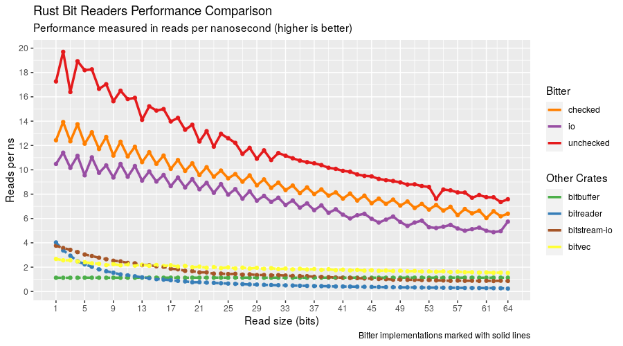

# Bitter

***Reading bits until the bitter end***

 [](https://docs.rs/bitter) [](https://crates.io/crates/bitter)

Bitter reads bits in a desired endian format platform agonistically. Performance is the distinguishing feature compared to other bit readers. See [benchmarks](https://github.com/nickbabcock/bitter#comparison-to-other-libraries) for more information.

## Features

 - ✔ support for little endian, big endian, and native endian formats
 - ✔ request an arbitrary amount of bits (up to 56 bits)
 - ✔ ergonomic requests for common data types (eg: `u8` ... `u32`, `f32`, etc)
 - ✔ throughput exceeds 2 GiB/s for small reads (< 10 bits) and 10 GiB/s for larger reads
 - ✔ zero allocations
 - ✔ zero dependencies
 - ✔ `no_std` compatible

## Example

The example below gives a good demonstration of the main API surface area to decode a 16 bit data model. It strikes a good balance between ergonomics and speed.

```rust
use bitter::{BitReader, LittleEndianReader};
let mut bits = LittleEndianReader::new(&[0xff, 0x04]);
assert_eq!(bits.bytes_remaining(), 2);
assert_eq!(bits.read_bit(), Some(true));
assert_eq!(bits.bytes_remaining(), 1);
assert_eq!(bits.read_u8(), Some(0x7f));
assert!(bits.has_bits_remaining(7));
assert_eq!(bits.read_bits(7), Some(0x02));
```

However, one can unlock additional performance by amortizing internal state logic management when exploiting patterns in the encoded data. Colloquially known as Manual Mode, our example from before can be rewritten to take advantage of our domain knowledge that we'll be decoding 16 bits.

```rust
use bitter::{BitReader, LittleEndianReader};
let mut bits = LittleEndianReader::new(&[0xff, 0x04]);

// Always start manual management with a refill, which
// will return the number of bits buffered
let len = bits.refill_lookahead();

// We need at least 16 bits buffered
assert!(len >= 16);

// We use a combination of peek and consume instead of read_*
assert_eq!(bits.peek(1), 1);
bits.consume(1);

// Notice how the return type is not an `Option`
assert_eq!(bits.peek(8), 0x7f);
bits.consume(8);

// We can switch back to auto mode any time
assert!(bits.has_bits_remaining(7));
assert_eq!(bits.read_bits(7), Some(0x02));
```

The refill, peek, and consume combination are the building blocks for Manual Mode, and allows fine grain management for hot loops. The surface area of Manual Mode APIs is purposely compact to keep things simple. The "Auto Mode" API (the functions with `read_` prefix) is larger as that API should be the one reaches for first

Manual mode can be intimidating, but it's one of if not the fastest way to decode a bit stream, as it's based on variant 4 from [Fabian Giesen's excellent series on reading bits](https://fgiesen.wordpress.com/2018/02/20/reading-bits-in-far-too-many-ways-part-2/). Others have employed this underlying technique to [significantly speed up DEFLATE](https://dougallj.wordpress.com/2022/08/20/faster-zlib-deflate-decompression-on-the-apple-m1-and-x86/).

Still, the limitation of a bit reading library only able to read up to 56 bits seems arbitrary and limiting. This can be mitigated through a couple measures. The first is to use a static assertion so we know refilling the lookahead buffer can yield sufficient data if available.

```rust
use bitter::{BitReader, LittleEndianReader};
let mut bits = LittleEndianReader::new(&[0xff, 0x04]);

const _: () = assert!(
    bitter::MAX_READ_BITS >= 16,
    "lookahead bit buffer not large enough for our data"
);

let len = bits.refill_lookahead();
if len < 16 {
    panic!("Early EOF");
}

// ... peek & consume ...
```

The read size limitation can be eliminated by emulating larger reads. For instance, decoding a 128 bit number:

```rust
use bitter::{BitReader, LittleEndianReader};

let value: i128 = 0x12345678901234567890123456789012;
let data = value.to_le_bytes();
let mut bits = LittleEndianReader::new(&data);
let mut out = [0u8; core::mem::size_of::<i128>()];
assert!(bits.read_bytes(&mut out));
assert_eq!(i128::from_le_bytes(out), value);
```

Or one can break it down into manageable chunks:

```rust
use bitter::{BitReader, LittleEndianReader};

let data: [u8; 8] = [0xab, 0xcd, 0xef, 0x01, 0x23, 0x45, 0x67, 0x89];
let bits_to_read = 60u32;
let value: u64 = 0x123456789;
let mut bits = LittleEndianReader::new(&data);
assert!(bits.has_bits_remaining(bits_to_read as usize));
assert!(bits.refill_lookahead() >= bitter::MAX_READ_BITS);

let lo = bits.peek(bitter::MAX_READ_BITS);
bits.consume(bitter::MAX_READ_BITS);

let hi_bits = bits_to_read - bitter::MAX_READ_BITS;
assert!(bits.refill_lookahead() >= hi_bits);

let hi = bits.peek(hi_bits);
bits.consume(hi_bits);

let mut expected = [0u8; 8];
expected.copy_from_slice(&data);
expected[7] = 0x09;

assert_eq!((hi << bitter::MAX_READ_BITS) + lo, u64::from_le_bytes(expected));
```

There's one final trick that bitter exposes that dials performance to 11 at the cost of safety and increased assumptions. Welcome to the unchecked refill API (referred to as "unchecked"), which can only be called when there are at least 8 bytes left in the buffer. Anything less than that can cause invalid memory access. The upside is that this API unlocks the holy grail of branchless bit reading.

Always consider guarding unchecked access at a higher level:

```rust
use bitter::{BitReader, LittleEndianReader};

let mut bits = LittleEndianReader::new(&[0u8; 100]);
let objects_to_read = 10;
let object_bits = 56;
let bitter_padding = 64;

// make sure we have enough data to read all our objects and there is enough
// data leftover so
if bits.has_bits_remaining(objects_to_read * object_bits + bitter_padding) {
    for _ in 0..objects_to_read {
        unsafe { bits.refill_lookahead_unchecked() };
        let _field1 = bits.peek(2);
        bits.consume(2);

        let _field2 = bits.peek(18);
        bits.consume(18);

        let _field3 = bits.peek(18);
        bits.consume(18);

        let _field4 = bits.peek(18);
        bits.consume(18);
    }
}
```

All three modes: auto, manual, and unchecked can be mixed and matched as desired.

### `no_std` crates

This crate has a feature, `std`, that is enabled by default. To use this crate
in a `no_std` context, add the following to your `Cargo.toml`:

```toml
[dependencies]
bitter = { version = "x", default-features = false }
```

## Comparison to other libraries

Bitter is hardly the first Rust library for handling bits.
[nom](https://crates.io/crates/nom),
[bitvec](https://github.com/bitvecto-rs/bitvec),
[bitstream_io](https://crates.io/crates/bitstream-io), and
[bitreader](https://crates.io/crates/bitreader) are all crates that deal with bit reading.
The reason why someone would choose bitter is speed.



Takeaways:

* Chaining small bit reads with the manual or unchecked API allows Bitter to issue over 30 read commands _per nanosecond_
* At any bit read size (including the emulated reads greater than 56 bits), bitter is the fastest Rust bit reading library even using the safest Auto API
* At large read sizes, differences between the bitter APIs and the next fastest (bitbuffer) start to diminish.

## Benchmarking

Benchmarks are ran with the following command:

```bash
(cd compare && cargo clean && RUSTFLAGS="-C target-cpu=native" cargo bench)
find ./compare/target -path "*bit-reading*" -wholename "*/new/raw.csv" -print0 \
  | xargs -0 xsv cat rows > assets/bitter-benchmark-data.csv
```

And can be analyzed with the R script found in the assets directory. Keep in mind, benchmarks will vary by machine
