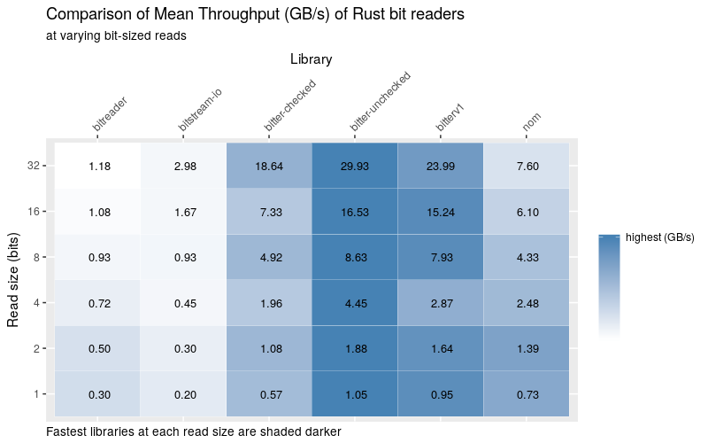

# Bitter

***Reading bits until the bitter end***

 [](https://docs.rs/bitter) [](https://crates.io/crates/bitter)

Bitter takes a slice of byte data and reads bits in a desired endian format platform agonistically.

## Features

 - ✔ support for little endian, big endian, and native endian formats
 - ✔ request an arbitrary amount of bits (up to 32 bits)
 - ✔ ergonomic requests for common data types (including `u64` / `i64`)
 - ✔ > 5 GB/s throughput when reading large number of bits
 - ✔ > 1 GB/s throughput when reading single digit sized chunks of bits
 - ✔ two APIs: one for safety and one for speed
 - ✔ zero allocations
 - ✔ `no_std` compatible

## Example

```rust
use bitter::{BitReader, LittleEndianBits};
let mut bitter = LittleEndianBits::new(&[0xff, 0x04]);
assert_eq!(bitter.read_bit(), Some(true));
assert_eq!(bitter.read_u8(), Some(0x7f));
assert_eq!(bitter.read_u32_bits(7), Some(0x02));
```

There are two main APIs available: checked and unchecked functions. The above example uses the checked API as return types are options to designate that there wasn't sufficient data to complete the read. Unchecked APIs will exhibit
undefined behavior if there is not enough data left, but can be significantly faster. 

Tips:

- Prefer checked functions for all but the most performance critical code
- Group all unchecked functions in a single block guarded by a `has_bits_remaining` call

Below is a demonstration of the unchecked APIs with a guard to ensure safety:

```rust
use bitter::{BitReader, LittleEndianBits};
let mut bitter = LittleEndianBits::new(&[0xff, 0x04]);
if bitter.has_bits_remaining(16) {
    assert_eq!(bitter.read_bit_unchecked(), true);
    assert_eq!(bitter.read_u8_unchecked(), 0x7f);
    assert_eq!(bitter.read_u32_bits_unchecked(7), 0x02);
}
```

Another guard usage:

```rust
use bitter::{BitReader, LittleEndianBits};
let mut bitter = LittleEndianBits::new(&[0xff, 0x04]);
if bitter.has_bits_remaining(16) {
    for _ in 0..8 {
        assert_eq!(bitter.read_bit_unchecked(), true);
    }
    assert_eq!(bitter.read_u8_unchecked(), 0x04);
}
```

### `no_std` crates

This crate has a feature, `std`, that is enabled by default. To use this crate
in a `no_std` context, add the following to your `Cargo.toml`:

```toml
[dependencies]
bitter = { version = "x", default-features = false }
```

## Comparison to other libraries

Bitter is hardly the first Rust library for handling bits.
[nom](https://crates.io/crates/nom),
[bitstream_io](https://crates.io/crates/bitstream-io), and
[bitreader](https://crates.io/crates/bitreader) are crates one should consider.
The reason why someone would choose bitter is speed.

## Benchmarking

Benchmarks are ran with the following command:

```
cargo clean
RUSTFLAGS="-C target-cpu=native" cargo bench -- bit-reading
find ./target -wholename "*/new/raw.csv" -print0 | xargs -0 xsv cat rows > assets/benchmark-data.csv
```

And can be analyzed with the R script found in the assets directory. Keep in mind, benchmarks will vary by machine


Takeaways from the above chart:

* Bitter unchecked APIs yield the greatest throughput across all read sizes
* Bitter checked APIs cost roughly half the throughput of bitter unchecked APIs
* While the first version of this library's unchecked APIs (bitterv1) are good, the current version has improved the checked versions to be close behind
* Nom performs very respectively for a library not specializing in bit reads
* Nom has a small but appreciable throughput with an increase in read sizes
* Other libraries should not be considered for performance sensitive areas

Since the chart lacks quotable numbers and is too dense to make an interpretation for small payloads, here is a table (for power of 2 read sizes).



Interpretations remain the same, but now one can compare performance numbers in a quantifiable manner.
