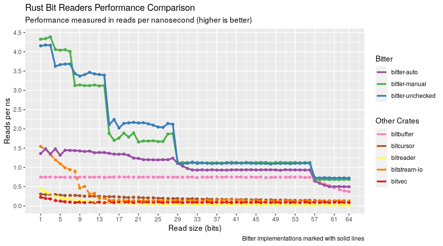

# Bitter

 [](https://docs.rs/bitter) [](https://crates.io/crates/bitter)

Bitter takes a slice of byte data and reads little-endian bits platform agonistically.

There are two main APIs available: checked and unchecked functions. A checked function will
return a `Option` that will be `None` if there is not enough bits left in the stream.
Unchecked functions, which are denoted by having "unchecked" in their name, will exhibit
undefined behavior if there is not enough data left, but happen to be 2x faster (your numbers
will vary depending on use case).

Tips:

- Prefer checked functions for all but the most performance critical code
- Group all unchecked functions in a single block guarded by a `has_bits_remaining` call

## Example

```rust
use bitter::BitGet;
let mut bitter = BitGet::new(&[0xff, 0x04]);
assert_eq!(bitter.read_bit(), Some(true));
assert_eq!(bitter.read_u8(), Some(0x7f));
assert_eq!(bitter.read_u32_bits(7), Some(0x02));
```

Below, is a demonstration of guarding against potential panics:

```rust
use bitter::BitGet;
let mut bitter = BitGet::new(&[0xff, 0x04]);
if bitter.has_bits_remaining(16) {
    assert_eq!(bitter.read_bit_unchecked(), true);
    assert_eq!(bitter.read_u8_unchecked(), 0x7f);
    assert_eq!(bitter.read_u32_bits_unchecked(7), 0x02);
}
```

Another guard usage:

```rust
use bitter::BitGet;
let mut bitter = BitGet::new(&[0xff, 0x04]);
if bitter.has_bits_remaining(16) {
    for _ in 0..8 {
        assert_eq!(bitter.read_bit_unchecked(), true);
    }
    assert_eq!(bitter.read_u8_unchecked(), 0x04);
}
```

## Comparison to other libraries

Bitter is hardly the first Rust library for handling bits.
[nom](https://crates.io/crates/nom),
[bitstream_io](https://crates.io/crates/bitstream-io), and
[bitreader](https://crates.io/crates/bitreader) are crates one should consider.
The reason why someone would choose bitter is speed.

## Benchmarking

Benchmarks are ran with the following command:

```
cargo clean
RUSTFLAGS="-C target-cpu=native" cargo bench -- bit-reading
find ./target -wholename "*/new/raw.csv" -print0 | xargs -0 xsv cat rows > assets/benchmark-data.csv
```

And can be analyzed with the R script found in the assets directory. Keep in mind, benchmarks will vary by machine



Takeaways from the above chart:

* Bitter unchecked APIs yield the greatest throughput across all read sizes
* Bitter checked APIs cost roughly half the throughput of bitter unchecked APIs
* While the first version of this library's unchecked APIs (bitterv1) are good, the current version has improved the checked versions to be close behind
* Nom performs very respectively for a library not specializing in bit reads
* Nom has a small but appreciable throughput with an increase in read sizes
* Other libraries should not be considered for performance sensitive areas

Since the chart lacks quotable numbers and is too dense to make an interpretation for small payloads, here is a table (for power of 2 read sizes).


Interpretations remain the same, but now one can compare performance numbers in a quantifiable manner.
